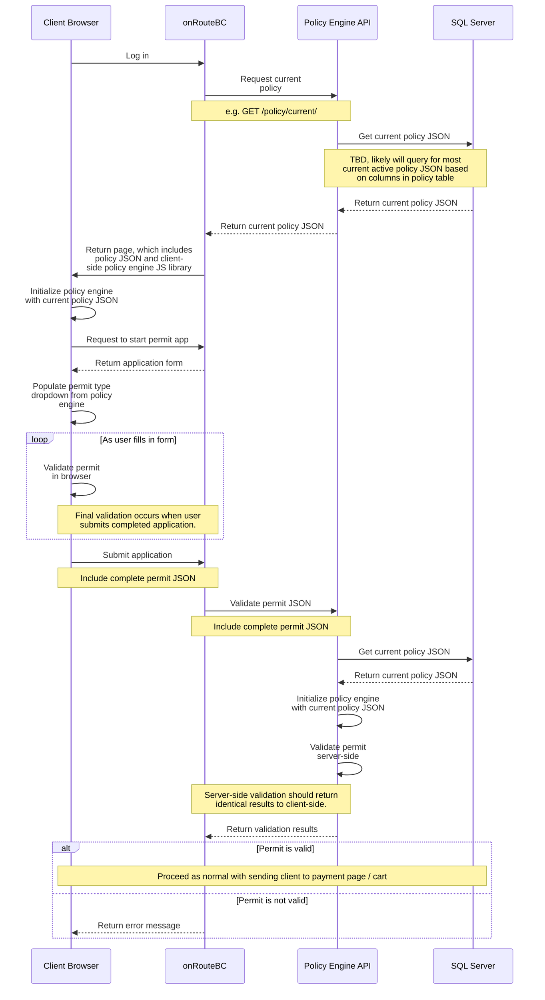

# Basic Client-Server Flow for Policy Engine

## Overview

The onRouteBC Policy Engine is implemented as a JavaScript module that can be used server-side with Node.js or in the browser. This document describes the basic flow of how the policy engine integrates with client and server applications.

## Core Principles

### Policy Engine Architecture

The policy engine is initialized with a JSON file describing policy rules. When methods of the policy engine are called, responses are generated based on the policy JSON that was used for initialization.

For example, a policy JSON includes lists of all valid permit types and vehicle types. When the `getPermitTypes()` or `getVehicleTypes()` methods are called, the response is based exclusively on those permit/vehicle types defined in the JSON. Notably, there are no 'built-in' permit or vehicle types - all are defined exclusively in the JSON configuration, providing maximum flexibility.

### Policy Version Management

The most current policy JSON describes Commercial Vehicle policy as of the current date. This policy JSON is stored in the onRouteBC SQL Server database in a dedicated table column. When policy changes are made, a new row is added to the table and the old policy JSON is end-dated. There is only ever one current policy JSON active at any given time.

**Key Benefits:**
- All previous policy versions are retained for historical reference
- The policy engine can be initialized with any arbitrary policy JSON for development and testing
- The policy engine doesn't care where the JSON comes from - it can be retrieved from the database or loaded from any source

### Development and Testing Workflow (For Future)

Initializing the policy engine with a policy JSON that is **not** the current version is particularly useful when new policy rules are being edited and need thorough testing before going live. In this scenario:

1. The new policy JSON is stored in the database in 'draft' state
2. The onRouteBC application is launched in test mode
3. The test environment loads the specific draft policy JSON instead of the current live policy

## API Integration

### Policy API Access

The policy JSON in the onRouteBC database is accessible only through a dedicated policy API. This API should be used by both backend and frontend applications to ensure consistency across the entire system.

**API Endpoints (For Future):**
- **Current Policy:** `GET /policy/current` - Retrieves the currently active policy JSON
- **Specific Policy:** `GET /policy/{id}` - Retrieves a specific policy version (e.g., `/policy/10042` for draft policy with ID 10042)

### Policy Engine Methods

The policy engine JavaScript library provides methods for various policy-related tasks:

- `getPermitTypes()` - Retrieve all valid permit types
- `getVehicleTypes()` - Retrieve all valid vehicle types  
- `getTrailerTypes()` - Retrieve all valid trailer types
- `getRules(permitType)` - Get rules applicable for a specific permit type
- `validate(permitApplication)` - Check a permit application against policy for violations or warnings

### Server-Side vs Client-Side Validation

Some policy engine methods are exposed through the policy engine API. For example, a `POST /policy/current/validate` endpoint could be implemented which would return identical results to executing the same validation in the browser using JavaScript.

The policy engine API simply delegates calls to the policy engine library running in Node.js on the backend and returns the response unmodified.

**Benefits of This Approach:**
- **Server-side validation** can be mandatory before a permit is issued
- **Client-side validation** can be executed quickly in-browser for intermediate validation steps (such as when users are filling out permit application forms)
- **Consistency** is maintained between client and server validation results
- **Performance** is improved by reducing constant server calls during form completion

## Client-Server Flow Diagram

The following sequence diagram illustrates the typical flow of a permit application through the system:

## Implementation Notes

### Policy Engine Initialization

The policy engine is initialized once per session with the current policy JSON. This ensures that all validations during the session use the same policy rules.

### Validation Consistency

Both client-side and server-side validation should produce identical results when using the same policy JSON. This is critical for maintaining user trust and system reliability.

### Performance Considerations

- **Client-side validation** provides immediate feedback during form completion
- **Server-side validation** ensures security and data integrity
- **Policy caching** can be implemented to reduce database queries
- **Incremental validation** can be performed as users complete form sections
